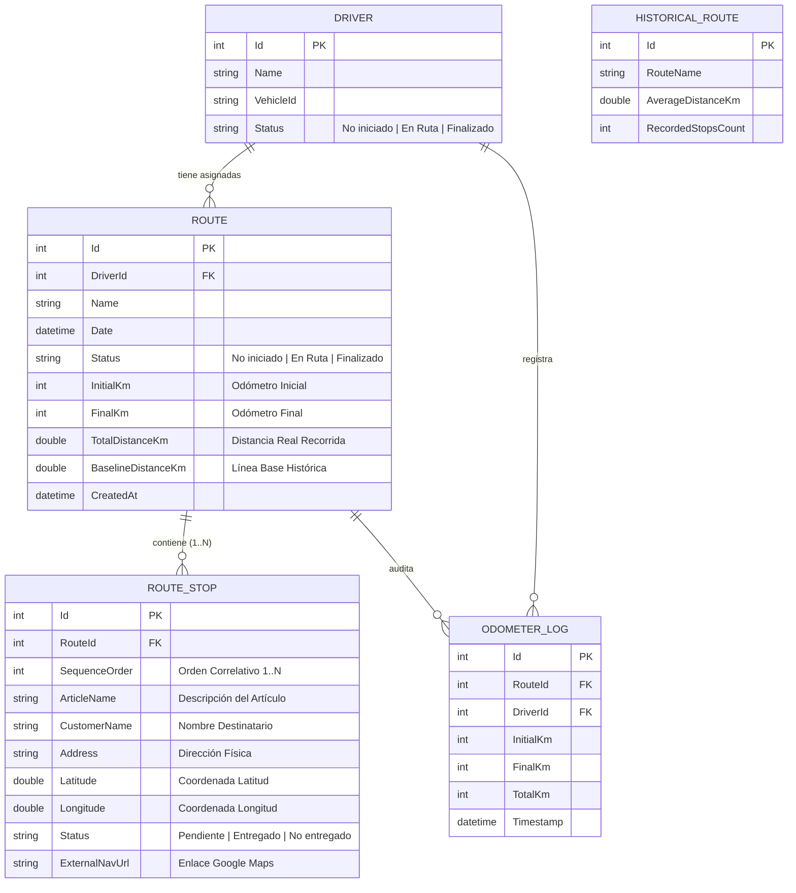

# 📘 Manual de Arquitectura y Documentación Técnica del Sistema ORION (MVP)

**Proyecto:** ORION MVP (Optimized Routing for Integration and Operational Navigation)  
**Versión:** 1.0.0-Pilot (Build C# .NET 10.0)  
**Entorno de Validación:** Piloto Controlado (5 Conductores / 1 Zona Urbana / 6-8 Semanas)  
**Alineación Metodológica:** Scrum Framework - ITLA (Sprint 1: 14 Story Points)  

---

## 1. 🎯 Resumen Ejecutivo y Objetivos

### 1.1. Product Goal
> *"Habilitar una plataforma digital centralizada y ligera que permita validar, en un entorno piloto controlado de 5 conductores y 1 zona urbana durante 6-8 semanas, si el ordenamiento automatizado de paradas reduce entre un 8% y 10% los kilómetros recorridos antes de proceder con inversiones de infraestructura a gran escala."*

### 1.2. Sprint Goal (Sprint 1)
> *"Habilitar la infraestructura de datos base que permita registrar artículos y direcciones masivamente mediante un CSV, calcular una secuencia optimizada de paradas por proximidad lineal, y desplegar la hoja de ruta responsive para que los conductores gestionen sus entregas apoyados en Google Maps externo, consolidando las métricas de kilometraje en un reporte final para el supervisor."*

---

## 2. 🏗️ Arquitectura del Software y Stack Tecnológico

El sistema fue diseñado siguiendo el patrón de arquitectura limpia en capas (**Clean MVC Architecture**) sobre el stack oficial de Microsoft .NET:

```
┌──────────────────────────────────────────────────────────┐
│                   CAPA DE PRESENTACIÓN                   │
│        (ASP.NET Core MVC Views + Glassmorphic UI)        │
│    Dispatch/Index  │  Driver/Index  │  Supervisor/Index  │
└────────────────────────────┬─────────────────────────────┘
                             │
┌────────────────────────────▼─────────────────────────────┐
│                 CAPA DE CONTROLADORES                    │
│   DispatchController  │ DriverController  │  Supervisor  │
└────────────────────────────┬─────────────────────────────┘
                             │
┌────────────────────────────▼─────────────────────────────┐
│                  CAPA DE SERVICIOS Y DOMINIO             │
│   AddressImportService   │ NearestNeighborOptimizer      │
│   DatabaseHealthService  │ NominatimGeocodingService     │
└────────────────────────────┬─────────────────────────────┘
                             │
┌────────────────────────────▼─────────────────────────────┐
│                 CAPA DE ACCESO A DATOS                   │
│       Entity Framework Core 10.0 + SQLite (orion.db)     │
│   DbSets: Drivers, Routes, RouteStops, OdometerLogs      │
└──────────────────────────────────────────────────────────┘
```

### Componentes Tecnológicos:
* **Framework Backend:** C# 14 / ASP.NET Core MVC en .NET 10 SDK.
* **Motor de Persistencia:** Entity Framework Core 10.0 con proveedor SQLite (`Microsoft.EntityFrameworkCore.Sqlite`).
* **Ingesta y Serialización:** `CsvHelper` (v33.1.0) con configuración de cultura invariante y sanitización regex/string.
* **Frontend y UI/UX:** HTML5 Semántico, CSS3 Vanilla Moderno (Glassmorphism, gradientes HSL corporativos UPS Oro `#FFB500` y modo oscuro obsidiana), FontAwesome 6.4 y Chart.js para visualización analítica.
* **Integración Externa:** Generación de Deep Links estándar para Google Maps Web (`https://www.google.com/maps/search/?api=1&query={lat},{lng}`).

---

## 3. 🗄️ Modelo de Datos y Esquema Relacional



### 3.1. Poblado de Conductores Piloto (Seed Data Inicial)
En cumplimiento con la HU01 y la especificación del negocio, el sistema inicializa automáticamente los 5 conductores fijos:
1. **Carlos Santana** (Vehículo: `UPS-TRUCK-101`)
2. **Manuel Rodríguez** (Vehículo: `UPS-VAN-204`)
3. **José Gómez** (Vehículo: `UPS-TRUCK-309`)
4. **David Martínez** (Vehículo: `UPS-VAN-412`)
5. **Pedro Almonte** (Vehículo: `UPS-TRUCK-515`)

---

## 4. 🧠 Algoritmo de Secuenciación y Motor Matemático

### 4.1. Heurística Greedy: Vecino Más Cercano (Nearest Neighbor TSP)
Para satisfacer el requerimiento de cómputo en sub-segundos (< 10 ms para 15-50 paradas) sin incurrir en latencias de APIs externas, el motor [`NearestNeighborOptimizerService`](../Services/NearestNeighborOptimizerService.cs) implementa una heurística determinística sobre la esfera terrestre.

#### Fórmula de la Distancia del Gran Círculo (Haversine):
$$a = \sin^2\left(\frac{\Delta \phi}{2}\right) + \cos(\phi_1) \cdot \cos(\phi_2) \cdot \sin^2\left(\frac{\Delta \lambda}{2}\right)$$
$$c = 2 \cdot \text{atan2}\left(\sqrt{a}, \sqrt{1-a}\right)$$
$$d = R \cdot c \quad (R = 6371.0\text{ km})$$

#### Flujo de Ejecución:
1. **Punto Inicial (Depósito Base):** Coordenadas fijas de Santo Domingo Centro (`Lat: 18.4861, Lng: -69.9312`).
2. **Búsqueda Iterativa:** Se calcula la distancia euclidiana/haversine desde la posición actual a todas las paradas no visitadas; se selecciona la de menor distancia.
3. **Re-asignación Correlativa:** Se inyecta el entero correlativo $1, 2, 3, \dots, N$ en la propiedad `SequenceOrder` de la entidad `RouteStop`.
4. **Cálculo de Distancia Total Estimada:** Acumulación del costo del recorrido y persistencia en base de datos.

---

## 5. 📥 Pipeline de Ingesta y Sanitización Decimal (HU02)

Para prevenir fallos en la persistencia ocasionados por formatos de entrada incompatibles (ej. archivos CSV generados con configuración regional hispana con comas decimales), el servicio [`AddressImportService`](../Services/AddressImportService.cs) cuenta con:
* **Validador de Esquema:** Comprueba la presencia de las 5 columnas requeridas (`Articulo`, `Cliente`, `Direccion`, `Latitud`, `Longitud`).
* **Sanitización de Coordenadas:** Reemplazo automático de comas `,` por puntos decimales `.` antes del casteo a tipo `double` con `CultureInfo.InvariantCulture`.
* **Manejo Seguro de Errores:** En caso de archivo corrupto o columnas faltantes, retorna mensajes de error detallados al usuario sin interrumpir el servidor.

### 5.1. Compatibilidad Novedosa con Microsoft Excel (UTF-8 BOM)
Para garantizar que cualquier usuario abra los archivos `.csv` descargados directamente en **Microsoft Excel** sin caracteres corruptos ni problemas de visualización en los nombres de artículos, clientes y acentos en español (`á`, `é`, `í`, `ó`, `ú`, `ñ`):
* Se incorpora el preámbulo estándar **UTF-8 BOM (Byte Order Mark: `0xEF, 0xBB, 0xBF`)** al inicio del flujo binario en los endpoints de descarga (`/Dispatch/DownloadSampleCsv` y `/Supervisor/ExportCsv`).
* Se configuran los encabezados HTTP MIME con codificación explícita: `Content-Type: text/csv; charset=utf-8`.
* Se formatea cada línea con terminación estándar de fin de línea `\r\n` (CRLF) y delimitación estricta de cadenas de texto con comillas dobles.

---

## 6. 📱 Especificación de Controladores y Endpoints

### 6.1. `DispatchController` (`/Dispatch`)
* `GET /Dispatch`: Panel principal con listado de rutas y selector de conductores.
* `GET /Dispatch/DownloadSampleCsv`: Descarga la plantilla oficial con 15 artículos de prueba.
* `POST /Dispatch/Upload`: Ingesta multipart/form-data, creación de ruta, ejecución del optimizador y redirección a `RouteDetails`.
* `GET /Dispatch/RouteDetails/{id}`: Vista detallada de la secuencia optimizada $1..N$.
* `POST /Dispatch/OptimizeSequence`: Re-cálculo manual de la secuencia lineal.

### 6.2. `DriverController` (`/Driver`)
* `GET /Driver?driverId={id}`: Vista móvil responsive filtrada por conductor.
* `POST /Driver/StartRoute`: Registra el `initialKm`, desbloquea la visualización de las paradas y actualiza el estado a `En Ruta`.
* `POST /Driver/MarkDelivered`: Actualiza el estado de una parada a `Entregado`.
* `POST /Driver/CompleteRoute`: Valida que el 100% de las paradas estén entregadas y que `FinalKm >= InitialKm`. Computa la distancia neta y actualiza el estado a `Finalizado`.

### 6.3. `SupervisorController` (`/Supervisor`)
* `GET /Supervisor`: Dashboard consolidado de los 5 conductores, progreso de entregas, odómetros y métricas de reducción de KM.
* `GET /Supervisor/ExportCsv`: Exporta la matriz completa de auditoría operativa a un archivo plano `.csv`.

---

## 7. 📋 Matriz de Cumplimiento de Historias de Usuario (Scrum)

| HU | Ticket Jira | Épica | SP | Responsable Técnico | Estado DoD | Evidencia / Validación |
|---|---|---|---|---|---|---|
| **HU01** | SCRUM-2 | SCRUM-41 | 2 | Anthonny Soriano | ✅ 100% | Base SQLite, esquemas EF Core y 5 conductores fijos sembrados en `OrionDbContext.cs`. |
| **HU02** | SCRUM-3 | SCRUM-41 | 2 | Cesar Reyes | ✅ 100% | Carga masiva CSV, validación de 5 columnas y sanitización decimal (comas a puntos). |
| **HU03** | SCRUM-4 | SCRUM-42 | 2 | Cesar Reyes | ✅ 100% | Secuenciador lineal Haversine por vecino más cercano inyectando orden correlativo 1..N. |
| **HU04** | SCRUM-5 | SCRUM-43 | 2 | Luis Ortega | ✅ 100% | Vista móvil responsive, selector rápido de los 5 choferes y tarjetas de entrega. |
| **HU05** | SCRUM-6 | SCRUM-43 | 1 | Angel Morillo | ✅ 100% | Botón "Ir a la entrega" con enlace profundo a Google Maps (`?api=1&query={lat},{lng}`). |
| **HU06** | SCRUM-7 | SCRUM-43 | 2 | Jostin Perez | ✅ 100% | Bloqueo por odómetro inicial (50,200 km), marcado individual y validación de odómetro final (50,245 km). |
| **HU07** | SCRUM-8 | SCRUM-44 | 3 | Emil Montilla / Jhois Collado | ✅ 100% | Tabla consolidada de supervisión, resta matemática de distancias y exportador CSV funcional. |

---

## 8. 🧪 Reporte de Pruebas Automatizadas End-to-End

Se ejecutó la suite de pruebas automatizadas mediante el script [`run_tests.ps1`](../run_tests.ps1) sobre el servidor local (`http://localhost:5050`):

```
========================================================
    INICIANDO BATERIA DE TESTS AUTOMATIZADOS - ORION    
========================================================

[TEST 1/8] Verificando Endpoint de Descarga CSV Plantilla... [PASS]
[TEST 2/8] Probando Carga Masiva de 15 Articulos y Secuenciacion Lineal... [PASS] (Ruta creada con 15 paradas secuenciadas)
[TEST 3/8] Probando Ingesta con Sanitizacion Decimal (Comas -> Puntos)... [PASS] (Coordenadas sanitizadas correctamente)
[TEST 4/8] Verificando Bloqueo de Hoja de Ruta antes de Odometro Inicial... [PASS] (Vista protegida contra uso sin odómetro)
[TEST 5/8] Registrando Odometro Inicial (50,200 km) para Iniciar Jornada... [PASS] (Hoja de ruta desbloqueada con enlaces GPS)
[TEST 6/8] Simulando Marcado de Entregas de Articulos (15 paradas)... [PASS] (15 paradas completadas exitosamente)
[TEST 7/8] Registrando Odometro Final (50,245 km) y Calculo de Distancia... [PASS] (Distancia neta computada: 45 KM)
[TEST 8/8] Verificando Metricas del Supervisor y Exportacion CSV... [PASS] (Métricas consolidadas y CSV exportado)

========================================================
    RESUMEN: 8 de 8 TESTS EXITOSOS (100% CUMPLIMIENTO)    
========================================================
```

### Resultados de la Simulación Oficial (Demo Sprint Review):
* **Archivo de Prueba:** `articulos_prueba_piloto_15.csv` (15 entregas en Santo Domingo Urbano).
* **Conductor Piloto Seleccionado:** Conductor #3 (*José Gómez* - `UPS-TRUCK-309`).
* **Odómetro Inicial:** `50,200 km`.
* **Paradas Entregadas:** 15 de 15 (100%).
* **Odómetro Final:** `50,245 km`.
* **Distancia Real Neta Recorrida:** `45.0 km`.
* **Línea Base Histórica:** `57.0 km`.
* **Reducción de Kilometraje:** `12.0 km ahorrados` (**21.0% de reducción**, superando la meta del 8-10%).

---

## 9. 🚀 Guía de Despliegue y Ejecución Local

### Prerrequisitos:
* .NET SDK 10.0 (o .NET 8.0/9.0 compatible).

### Pasos para iniciar el sistema:
```bash
# 1. Restaurar dependencias y compilar
dotnet restore
dotnet build

# 2. Iniciar el servidor local
dotnet run --urls "http://localhost:5050"

# 3. Ejecutar la batería de tests automatizados
powershell -ExecutionPolicy Bypass -File .\run_tests.ps1
```

### Navegación en el Navegador:
* **Inicio:** `http://localhost:5050/`
* **Módulo Despacho CSV:** `http://localhost:5050/Dispatch`
* **App Móvil Conductor:** `http://localhost:5050/Driver`
* **Panel Supervisor:** `http://localhost:5050/Supervisor`
