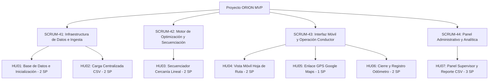

# Documentación HU00: Estructura del Proyecto, Scrum Team y Configuración Base

## 📋 Información General del Proyecto y Scrum Framework

* **Proyecto:** ORION MVP (Optimized Routing for Integration and Operational Navigation)
* **Objetivo del Producto (Product Goal):** "Habilitar una plataforma digital centralizada y ligera que permita validar, en un entorno piloto controlado de 5 conductores y 1 zona urbana durante 6-8 semanas, si el ordenamiento automatizado de paradas reduce entre un 8% y 10% los kilómetros recorridos antes de proceder con inversiones de infraestructura a gran escala."
* **Herramienta de Gestión:** [Tablero Jira ORION - ITLA](https://itla-adm.atlassian.net/jira/software/projects/SCRUM/boards/1)
* **Sprint Goal:** "Habilitar la infraestructura de datos base que permita registrar artículos y direcciones masivamente mediante un CSV, calcular una secuencia optimizada de paradas por proximidad lineal, y desplegar la hoja de ruta responsive para que los conductores gestionen sus entregas apoyados en Google Maps externo, consolidando las métricas de kilometraje en un reporte final para el supervisor."

---

## 👥 Scrum Team y Asignaciones

| Rol | Integrante | Correo Institucional | Responsabilidad Principal |
|---|---|---|---|
| **Product Owner (PO)** | Angel Luis Rosario | 20240079@itla.edu.do | Gestión del Product Backlog, validación de criterios de aceptación y alineación estratégica. |
| **Scrum Master (SM)** | Juan Ectiversom Celedonio Solano | 20241562@itla.edu.do | Facilitación ágil, remoción de impedimentos técnicos y mantenimiento del flujo en Jira. |
| **Developer** | Anthonny Brayhan Soriano Franco | 20242266@itla.edu.do | Arquitectura de datos, esquemas e inicialización de BD (HU01). |
| **Developer** | Cesar Reyes | 20241308@itla.edu.do | Ingesta CSV, sanitización decimal y secuenciación lineal (HU02, HU03). |
| **Developer** | Luis Manuel Ortega Mejia | 20221134@itlaedudo.onmicrosoft.com | Frontend móvil responsive para hojas de ruta del conductor (HU04). |
| **Developer** | Angel Gabriel Morillo Rosario | 20230554@itla.edu.do | Integración externa por enlaces profundos a Google Maps (HU05). |
| **Developer** | Jostin Wilmer Perez | 20221096@itlaedudo.onmicrosoft.com | Captura en campo y validación de odómetro inicial/final (HU06). |
| **Developer** | Emil Hari Montilla Salvador | 20220287@itlaedudo.onmicrosoft.com | Frontend del panel de control consolidado del supervisor (HU07). |
| **Developer** | Jhois Collado | 20211124@itla.edu.do | Backend analítico, cálculo de distancias y exportador CSV (HU07). |
| **QA Engineer** | Josteen Mayobanex Del Orbe | 20240270@itla.edu.do | Aseguramiento de calidad, pruebas unitarias y validación de criterios. |
| **QA Engineer** | Yassil Del Orbe | 20242536@itla.edu.do | Pruebas de integración, simulación de campo con 5 conductores piloto. |

---

## 🖼️ Evidencia del Tablero Activo en Jira

---

## 🗂️ Arquitectura de Épicas del Sprint 1 (Total: 14 Story Points)

---

## 🛠️ Estructura Técnica de la Solución (C# .NET 10 ASP.NET Core MVC)

1. **Backend y Capa de Datos**:
   * ASP.NET Core MVC con Entity Framework Core SQLite (`OrionDbContext.cs`).
   * Servicios inyectados para optimización (`NearestNeighborOptimizerService.cs`) e ingesta CSV (`AddressImportService.cs`).
2. **Frontend UI/UX**:
   * Sistema de diseño responsive con paleta temática UPS (Oro `#FFB500`, Obsidiana, Acentos Neón).
   * Vistas especializadas por rol: Despacho (`/Dispatch`), Conductor (`/Driver`), Supervisor (`/Supervisor`).
3. **Definition of Done (DoD)**:
   * [x] El código compila limpiamente sin errores de sintaxis (`dotnet build`).
   * [x] Formularios y campos interactivos cuentan con validaciones nativas.
   * [x] Los datos persisten correctamente en la base de datos relacional.
   * [x] Interfaz responsive validada en resoluciones móviles y de escritorio.
   * [x] 100% de criterios de aceptación verificados.
